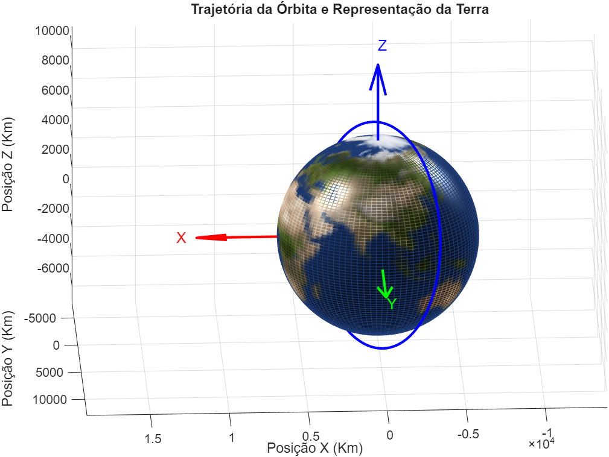
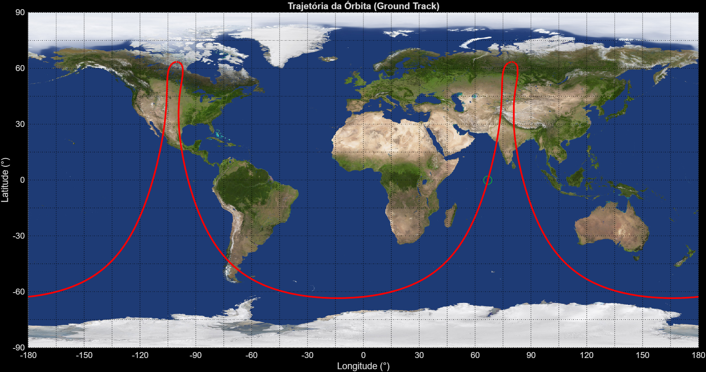

# Satellite Dynamics & Ground Track Toolkit

A MATLAB collection for satellite orbit propagation, coordinate system transformations, and ground track visualization.

### 1. Orbit Propagation (`/Orbit`)
Focused on 3D visualization of orbital paths relative to a static Earth model.
- **`Atvi1_vetor_RV.m`**: Plots 3D orbits using state vectors (Position and Velocity).
- **`Atvi2_TLE.m`**: Propagates and visualizes orbits directly from TLE (Two-Line Element) data.
- **Visualization:** Includes a textured 3D sphere representing Earth with accurate proportions.

### 2. Ground Track & Geodetic Analysis (`/Ground_track`)
Scripts that account for **Earth's rotation** and coordinate transformations.
- **`Rel2_Atvi1.m`**: Performs geodetic-to-cartesian conversion. Calculates **Greenwich Mean Sidereal Time (GMST)** to determine the inertial direction (unit vector) of a geographic point at a specific epoch.
- **`Rel2_Atvi2.m`**: Generates 2D ground tracks using TLE data, accounting for Earth's rotation to map the satellite's footprint accurately over time.

## Technical Implementation
- **Coordinate Systems:** Transitioning between ECEF (Earth-Centered, Earth-Fixed) and ECI (Earth-Centered Inertial) frames.
- **Numerical Methods:** Time-keeping and sidereal rotation adjustments.
- **Graphics:** Custom sphere masking for accurate Earth modeling in MATLAB..

## Visual Results
### 3.D Orbit vs. 2D Ground Track
| 3D Orbit Propagation | 2D Ground Track (Rotation-aware) |
| :---: | :---: |
|  |  |

## 📖 How to Run
1. Clone the repository.
2. Open MATLAB and navigate to the desired folder (`/Orbit` or `/Ground_track`).
3. Run the main scripts to generate plots and coordinate transformations.

---
Developed by **Diego de Oliveira Peralta**
